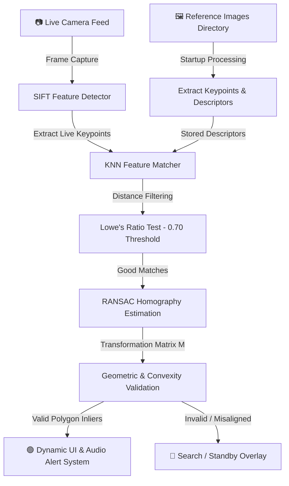

# 👁️ Real-Time Multi-Object Identifier

[](https://www.python.org/)
[](https://opencv.org/)
[](https://numpy.org/)
[](LICENSE)

An end-to-end computer vision pipeline for real-time verification and geometric tracking of target objects from a live camera feed.

Built using **OpenCV SIFT feature extraction**, **KNN descriptor matching**, and **RANSAC-backed planar homography**.

---

## 🏗️ System Architecture

The complete detection pipeline works as follows:



---

## ⚡ Key Features

* **Multi-Object Verification:** Tracks and labels multiple distinct reference items concurrently from a single live camera stream.
* **RANSAC Inlier Validation:** Rejects noise and false-positive matches by ensuring spatial and geometric consistency.
* **Dynamic BGR Color Grading:** Smoothly transitions target bounding boxes and match indicators from **Red (0% Match) → Yellow (50% Match) → Green (100% Match)**.
* **Interactive GUI:** Provides a real-time visual interface with detection overlays and status indicators.
* **Audio Alerts:** Uses non-blocking multi-threaded beep notifications when a valid object is detected.
* **Interactive Exit:** Includes both a clickable **EXIT** button and a keyboard shortcut for safely terminating the application.

---

## 📁 Project Structure

```text
Image-identifier-using-OpenCV/
├── reference_images/         # Target object images
│   └── reference.jpg
├── src/
│   ├── __init__.py           # Package marker
│   └── detector.py           # Detection & geometric validation engine
├── .gitignore                # Git exclusion rules
├── main.py                   # Real-time video stream & UI renderer
├── README.md                 # Project documentation
└── requirements.txt          # Python dependencies
```

---

## 🛠️ Setup & Installation

### 1. Clone the Repository

```bash
git clone https://github.com/xsparrkk/Image-identifier-using-OpenCV.git
cd Image-identifier-using-OpenCV
```

### 2. Create & Activate a Virtual Environment

A virtual environment is recommended to keep project dependencies isolated.

#### Windows

```bash
python -m venv venv
venv\Scripts\activate
```

### 3. Install Dependencies

```bash
pip install -r requirements.txt
```

---

## 📸 How to Test with Your Own Images

1. Capture a clear image of the target object.
2. Save the image inside the `reference_images/` directory.
3. Give the image a descriptive filename, such as:

   * `book.jpg`
   * `gamepad.png`
   * `remote.jpg`
   * `product_box.jpg`
4. Start the application.
5. The system automatically loads the available reference images during startup.
6. The image filename is used as the corresponding target label.

---

## 🚀 Running the Application

Launch the real-time detection system using:

```bash
python main.py
```

The application will access the webcam and begin processing the live camera feed.

---

## 🎮 GUI Controls

### Mouse

Click the red **[ EXIT ]** button in the top-right corner of the camera window to terminate the application.

### Keyboard

Press:

```text
q
```

at any time to safely terminate the camera feed.

---

## 🔬 Technical Deep Dive

| Component              | Function                                 | Implementation Detail                                                                   |
| ---------------------- | ---------------------------------------- | --------------------------------------------------------------------------------------- |
| **Feature Extraction** | SIFT (Scale-Invariant Feature Transform) | Extracts scale- and rotation-invariant keypoints with 128-dimensional descriptors.      |
| **Feature Matching**   | K-Nearest Neighbors (`k=2`)              | Finds candidate keypoint pairs between live camera frames and reference images.         |
| **Outlier Rejection**  | Lowe's Ratio Test                        | Keeps matches where `d₁ < 0.70 × d₂` to eliminate ambiguous feature matches.            |
| **Homography Mapping** | RANSAC                                   | Estimates the planar transformation while rejecting geometrically inconsistent matches. |
| **Shape Validation**   | Convexity & Area Check                   | Rejects invalid geometries such as twisted bow-tie polygons and collapsed shapes.       |

---

## 🧠 How the Detection Works

The system follows a multi-stage computer vision pipeline:

### 1. Reference Image Processing

At startup, the application loads the images stored inside `reference_images/` and extracts their SIFT keypoints and descriptors.

### 2. Live Frame Processing

Frames are continuously captured from the webcam and processed to identify visual features.

### 3. Feature Matching

The live-frame descriptors are compared with the descriptors extracted from the reference images using a KNN matcher.

### 4. Lowe's Ratio Test

Potentially ambiguous matches are filtered using Lowe's Ratio Test with a threshold of `0.70`.

### 5. Homography Estimation

If enough reliable feature matches are found, RANSAC is used to estimate a homography between the reference image and the detected object in the camera frame.

### 6. Geometric Validation

The resulting polygon is checked for geometric validity, including:

* Sufficient area
* Convexity
* Valid perspective transformation
* Adequate number of inlier matches

### 7. Detection & Feedback

When an object passes the validation stage, the system:

* Draws its detected boundary.
* Displays the object label.
* Updates the match visualization.
* Triggers the audio notification system.

---

## 🎨 Match Visualization

The detection interface uses a dynamic color scale to represent the matching confidence:

```text
🔴 Red       → Low / No Match
🟡 Yellow    → Moderate Match
🟢 Green     → Strong Match
```

---

## 🔮 Future Improvements

Potential improvements for future versions include:

* Real-time object tracking between frames
* Improved confidence scoring
* GPU acceleration
* Object detection using modern deep-learning models such as YOLO
* Automatic reference-image management
* Support for video files in addition to live camera input
* Web-based visualization dashboard
* Performance optimization for low-end hardware

---

## 📜 License

This project is distributed under the **MIT License**.

See the [`LICENSE`](LICENSE) file for more information.

---

## 👩‍💻 Author

**Mimansha Pandit**

B.Tech Computer Science & Engineering

GitHub: [@xsparrkk](https://github.com/xsparrkk)
